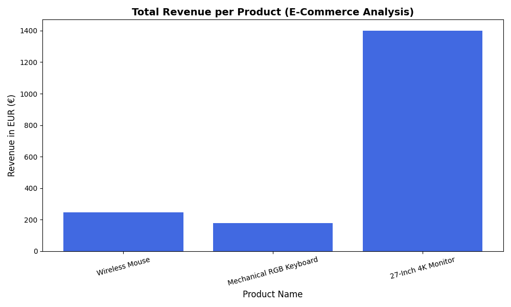

# E-Commerce Data Analytics Pipeline (SQL & Python)

Welcome to my portfolio project! This repository demonstrates an end-to-end data analytics workflow designed for an e-commerce platform. It covers everything from SQL database design to Python automation (ETL) and business intelligence visualization.

---

## 🚀 Project Architecture
The project is divided into three logical parts that simulate a real-world company environment:
1. **Database Design (SQL)**: Creating tables, setting up relational structures, and running analytical queries.
2. **ETL Automation (Python & Pandas)**: Extracting raw data from weekly CSV exports, transforming/cleaning anomalies, and loading clean data into PostgreSQL.
3. **Data Visualization (Matplotlib)**: Building executive dashboards to analyze product revenue performance.

---

## 🛠️ Tech Stack
* **Database**: PostgreSQL (pgAdmin 4)
* **Programming**: Python 3.14
* **Libraries**: Pandas, SQLAlchemy, Matplotlib, Psycopg2
* **Version Control**: Git & GitHub

---

## 📂 Project Structure & Files

* `project_1_ecommerce_queries.sql` -> SQL script containing table definitions (DDL) and sample business queries (Joins, Aggregations).
* `weekly_sales.csv` -> Simulated raw data export containing human errors, missing values (`NaN`), and negative quantities.
* `etl_script.py` -> Automated Python pipeline that reads the CSV, cleans up anomalies, and updates PostgreSQL automatically.
* `visualize_sales.py` -> Analytics script that fetches data from the database and generates performance charts.
* `product_revenue_chart.png` -> The final visualization output showing total revenue per product.

---

## 📈 Business Insights (Visual Output)
Below is the revenue chart automatically generated by the Python automation script, showcasing our best-performing products:

---

## 💡 Key Skills Demonstrated
* **Data Cleansing**: Handling missing records (`.fillna()`) and removing business anomalies (negative quantities) programmatically.
* **Database Relations**: Managing primary keys, foreign keys, and relational integrity.
* **Pipeline Engineering**: Bridging the gap between flat files (CSV), Python runtime, and production databases using Object-Relational Mapping (SQLAlchemy).
